<!-- Generado por build.py desde src/README.md y proyectos.json. No editar a mano. -->

<a href="https://alvaroalcaraz.com"><picture><source media="(prefers-color-scheme: dark)" srcset="assets/cabecera-oscuro.svg"></picture></a>

<a href="https://alvaroalcaraz.com/projects/predictor-pesca/"><picture><source media="(prefers-color-scheme: dark)" srcset="assets/destacado-oscuro.svg"></picture></a>

<a href="https://alvaroalcaraz.com/projects/alcaten/"><picture><source media="(prefers-color-scheme: dark)" srcset="assets/tarjeta-1-oscuro.svg"></picture></a>
<a href="https://github.com/alvaroalca/radar-licitaciones"><picture><source media="(prefers-color-scheme: dark)" srcset="assets/tarjeta-2-oscuro.svg"></picture></a>

<a href="https://alvaroalcaraz.com/projects/javier-alcaraz/"><picture><source media="(prefers-color-scheme: dark)" srcset="assets/tarjeta-3-oscuro.svg"></picture></a>
<a href="https://github.com/alvaroalca/panel-empleo"><picture><source media="(prefers-color-scheme: dark)" srcset="assets/tarjeta-4-oscuro.svg"></picture></a>

<a href="https://alvaroalcaraz.com/projects/flota/"><picture><source media="(prefers-color-scheme: dark)" srcset="assets/tarjeta-5-oscuro.svg"></picture></a>
<a href="https://alvaroalcaraz.com/projects/bot-trading/"><picture><source media="(prefers-color-scheme: dark)" srcset="assets/tarjeta-6-oscuro.svg"></picture></a>

<a href="https://alvaroalcaraz.com/projects/pulso/"><picture><source media="(prefers-color-scheme: dark)" srcset="assets/tarjeta-7-oscuro.svg"></picture></a>
<a href="https://alvaroalcaraz.com/projects/gafas-w610/"><picture><source media="(prefers-color-scheme: dark)" srcset="assets/tarjeta-8-oscuro.svg"></picture></a>

<a href="https://github.com/alvaroalca/fmto-bot"><picture><source media="(prefers-color-scheme: dark)" srcset="assets/breve-1-oscuro.svg"></picture></a>
<a href="https://alvaroalcaraz.com/projects/chatbot/"><picture><source media="(prefers-color-scheme: dark)" srcset="assets/breve-2-oscuro.svg"></picture></a>
<a href="https://alvaroalcaraz.com/juguete/"><picture><source media="(prefers-color-scheme: dark)" srcset="assets/breve-3-oscuro.svg"></picture></a>
<a href="https://alvaroalcaraz.com/projects/portfolio/"><picture><source media="(prefers-color-scheme: dark)" srcset="assets/breve-4-oscuro.svg"></picture></a>
<a href="https://github.com/alvaroalca/flutter-sports-training-manager"><picture><source media="(prefers-color-scheme: dark)" srcset="assets/breve-5-oscuro.svg"></picture></a>

<a href="https://alvaroalcaraz.com">alvaroalcaraz.com</a> · <a href="https://www.linkedin.com/in/alvaroalcaraz">LinkedIn</a> · <a href="mailto:alvaroalca@hotmail.com">alvaroalca@hotmail.com</a>

## Cómo trabajo

- **Agentic development a diario**: Claude Code sobre mis repos, con memoria por proyecto y un vault de conocimiento en Obsidian que da contexto entre sesiones.
- **El backend manda**: lógica de negocio en la base de datos (políticas RLS, triggers, RPCs), testeada con Docker en CI.
- **Coste como requisito**: mis proyectos corren en free tier vigilado. La arquitectura se decide también con la factura en la mano.

## Stack

`Dart / Flutter` · `JavaScript / TypeScript` · `Node.js` · `Python` · `PostgreSQL / Supabase` · `Cloudflare Workers` · `Firebase` · `Docker` · `Git / GitHub Actions` · `Claude API / Workers AI`
